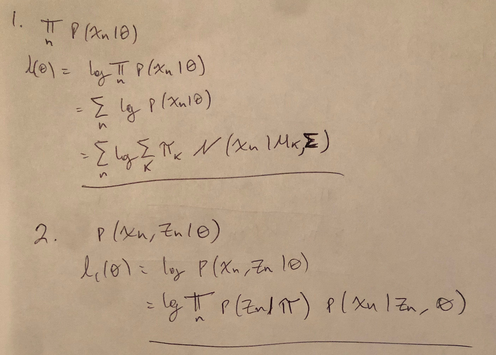
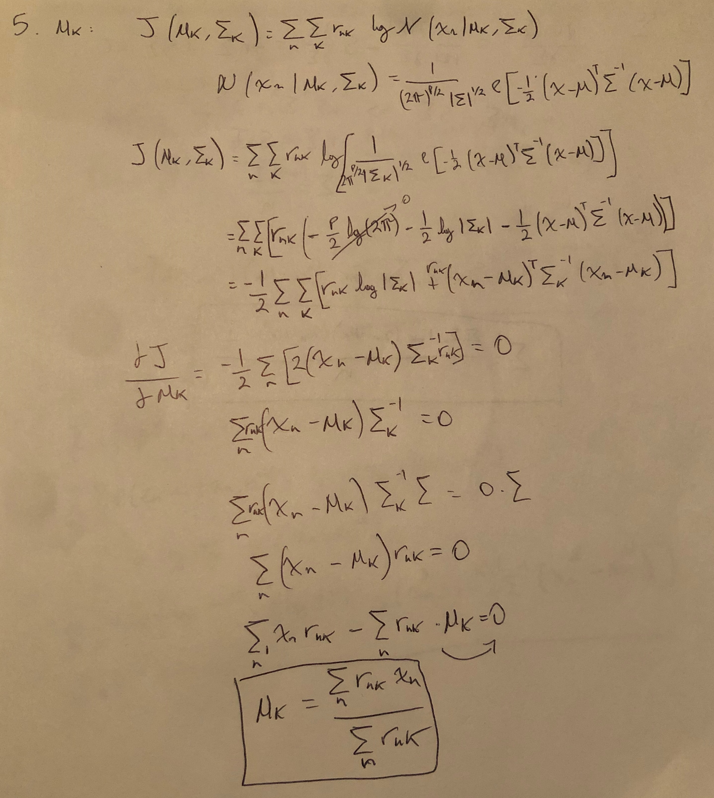
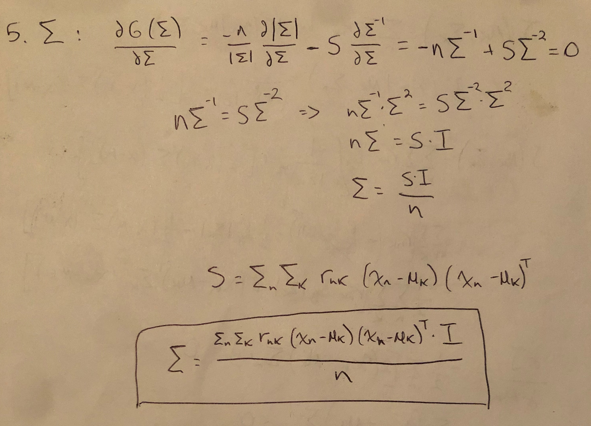
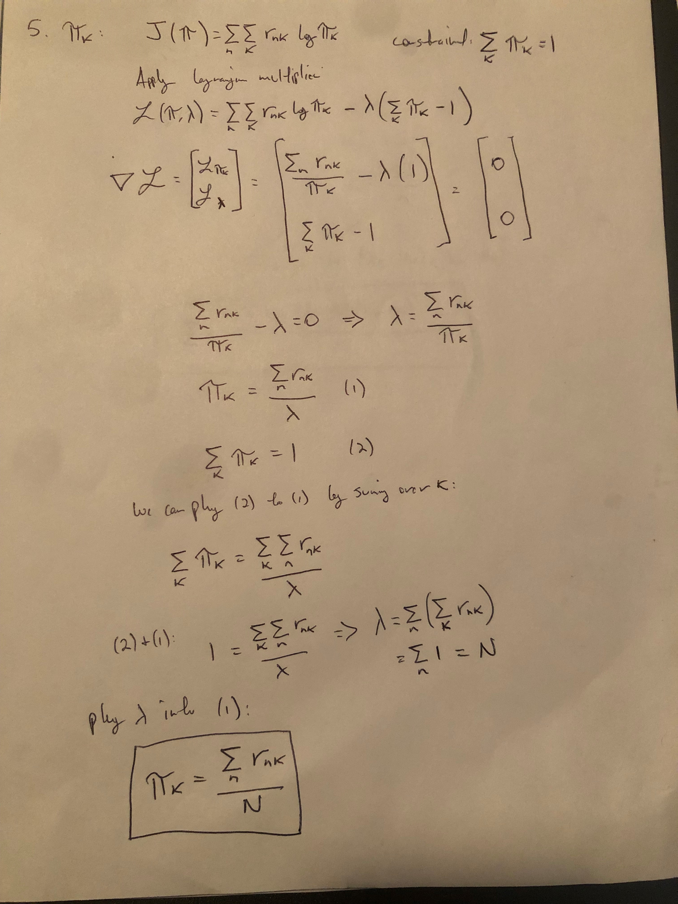

# Team Members

Javier Huamani
NetID: Huamani2
UIN: 654292064

Sudha Natarajan
NetID: Sudha2
UIN: 662428072

## Contributions

Contribution from each team member:

* Javier Huamani:  Completed the entirety of **Part1** of Coding assignment 4 including the derivations.
* Sudha Natarajan: Completed the entirety of **Part2** of Coding assignment 4.


# Part 1
  
## Prepared EM Functions 
  
  
```{r}
Estep <- function(data, G, para){
  # Your Code
  # Return the n-by-G probability matrix
  n = dim(data)[1]
  z = outer(1:n, 1:G,FUN = Vectorize(function(i, j) 
    -(1/2) * as.matrix(data[i,] - para$mean[,j]) %*% solve(para$Sigma) %*% t(as.matrix(data[i,] - para$mean[,j])) + log(para$prob[j]) )
  )
  
  # Subtracting max value of z to handle underflow problem
  z_max = apply(z, 1, max)
  z = exp(z - z_max) / rowSums(exp(z - z_max))
  
  z
}
Mstep <- function(data, G, para, post.prob){ 
  # Your Code
  # Return the updated parameters
  n = dim(data)[1]
  d = dim(data)[2]
  
  para$prob = colSums(post.prob) / n
  
  para$mean = outer(1:d, 1:G,FUN = Vectorize(function(i, j) 
    sum(as.matrix(post.prob[,j]*data[,i])) / sum(as.matrix(post.prob[,j]))
  ) )
  
  para$Sigma = matrix(0,d,d)
  
  for (g in 1:G){
    for (i in 1:n){
      para$Sigma = para$Sigma + (t(data[i,]) - para$mean[,g]) %*% t(t(data[i,]) - para$mean[,g]) * post.prob[i,g]
    }
  }
  para$Sigma = para$Sigma / n
  para
}

myEM <- function(data, itmax, G, para){
  # itmax: num of iterations
  # G:     num of components
  # para:  list of parameters (prob, mean, Sigma)
  for(t in 1:itmax){
    post.prob <- Estep(data, G, para)
    para <- Mstep(data, G, para, post.prob)
  }
  return(para)
}
```

```{r}
options(digits=8)
options()$digits
```

## Test Functions

```{r}
library(mclust)
dim(faithful)
head(faithful)
n = nrow(faithful)
```

### Two Clusters


```{r}
K <- 2
set.seed(2064)  
gID <- sample(1:K, n, replace = TRUE)
Z <- matrix(0, n, K)
for(k in 1:K)
  Z[gID == k, k] <- 1 
ini0 <- mstep(modelName="EEE", faithful , Z)$parameters
```

```{r}
para0 <- list(prob = ini0$pro, 
              mean = ini0$mean, 
              Sigma = ini0$variance$Sigma)
para0
```


```{r}
myEM(data=faithful, itmax=20, G=K, para=para0)
```


```{r}
Rout <- em(modelName = "EEE", data = faithful,
           control = emControl(eps=0, tol=0, itmax = 20), 
           parameters = ini0)$parameters
list(Rout$pro, Rout$mean, Rout$variance$Sigma)
```


### Three Clusters

```{r}
K <- 3
gID <- sample(1:K, n, replace = TRUE)
Z <- matrix(0, n, K)
for(k in 1:K)
  Z[gID == k, k] <- 1 
ini0 <- mstep(modelName="EEE", faithful , Z)$parameters
para0 <- list(prob = ini0$pro, 
              mean = ini0$mean, 
              Sigma = ini0$variance$Sigma)
para0
```


```{r}
myEM(data=faithful, itmax=20, G=K, para=para0)
```

```{r}
Rout <- em(modelName = "EEE", data = faithful,
           control = emControl(eps=0, tol=0, itmax = 20), 
           parameters = ini0)$parameters
list(Rout$pro, Rout$mean, Rout$variance$Sigma)
```

## Derivations

```{r 1_2, echo=FALSE, fig.cap="1 and 2", out.width = '100%'}

```

```{r 3_4, echo=FALSE, fig.cap="3 and 4", out.width = '100%'}
knitr::include_graphics("2nd.jpg")
```

```{r 5, echo=FALSE, fig.cap="5", out.width = '100%'}



```


# Part 2


```{r}
myBW = function(x, para, n.iter = 100){
  # Input:
  # x: T-by-1 observation sequence
  # para: initial parameter value
  # Output updated para value (A and B; we do not update w)
  
  for(i in 1:n.iter){
    para = BW.onestep(x, para)
  }
  return(para)
}

```


```{r}
BW.onestep = function(x, para){
  
  T = length(x)
  mz = para$mz
  mx = para$mx
  A = para$A
  B = para$B
  w = para$w
  alp = forward.prob(x, para)
  beta = backward.prob(x, para)
  
myGamma = array(0, dim=c(mz, mz, T-1))
  ## YOUR CODE: 
  ## Compute gamma_t(i,j) P(Z[t] = i, Z[t+1]=j), 
  ## for t=1:T-1, i=1:mz, j=1:mz, 
  ## which are stored an array, myGamma

  for (t in 1:(T-1)){
    for(i in 1:mz)
      for(j in 1:mz)
        myGamma[i,j,t]= alp[t,i]*A[i,j]* B[j, x[t+1]] *beta[t+1,j]
    
  }
  # for (t in 1:(T-1)){
  # myGamma[,,t]= outer(alp[t, ], B[, x[t+1]] * beta[t+1,]) * A
  #}
  

  # M-step for parameter A
  A = rowSums(myGamma, dims = 2)
  A = A/rowSums(A)
  # M-step for parameter B
  tmp = apply(myGamma, c(1, 3), sum)  # mz-by-(T-1)
  tmp = cbind(tmp, colSums(myGamma[, , T-1]))
  for(l in 1:mx){
    B[, l] = rowSums(tmp[, which(x==l)])
  }
  B = B/rowSums(B)
  
  para$A = A
  para$B = B
  return(para)
}

```


```{r}
forward.prob = function(x, para){
  # Output the forward probability matrix alp 
  # alp: T by mz, (t, i) entry = P(x_{1:t}, Z_t = i)
  T = length(x)
  mz = para$mz
  A = para$A
  B = para$B
  w = para$w
  alp = matrix(0, T, mz)
  
  # fill in the first row of alp
  alp[1, ] = w * B[, x[1]]
  # Recursively compute the remaining rows of alp
  for(t in 2:T){
    tmp = alp[t-1, ] %*% A
    alp[t, ] = tmp * B[, x[t]]
    }
  return(alp)
}

backward.prob = function(x, para){
  # Output the backward probability matrix beta
  # beta: T by mz, (t, i) entry = P(x_{1:t}, Z_t = i)
  T = length(x)
  mz = para$mz
  A = para$A
  B = para$B
  w = para$w
  beta = matrix(1, T, mz)

  # The last row of beta is all 1.
  # Recursively compute the previous rows of beta
  for(t in (T-1):1){
    tmp = as.matrix(beta[t+1, ] * B[, x[t+1]])  # make tmp a column vector
    beta[t, ] = t(A %*% tmp)
    }
  return(beta)
}

```


```{r}

myViterbi = function(x, para){
  # Output: most likely sequence of Z (T-by-1)
  T = length(x)
  mz = para$mz
  A = para$A
  B = para$B
  w = para$w
  log.A = log(A)
  log.w = log(w)
  log.B = log(B)
  
  # Compute delta (in log-scale)
  delta = matrix(0, T, mz) 
  # fill in the first row of delta
  delta[1, ] = log.w + log.B[, x[1]]
  
  ## YOUR CODE: 
  for (t in 2:T){
    for (i in 1:mz){
      delta[t,i] = max(delta[t-1,]+log.A[,i])+log.B[i, x[t]]
    }
  }
  
  ## Recursively compute the remaining rows of delta
  
  # Compute most prob sequence Z
  Z = rep(0, T)
  # start with the last entry of Z
  Z[T] = which.max(delta[T, ])
  
  ## YOUR CODE: 
  Z[T] = which.max(delta[T,])
  for (t in (T-1):1){
    Z[t] = which.max(delta[t,]+log.A[,Z[t+1]])
  }
  ## Recursively compute the remaining entries of Z
  
  return(Z)
}
```


## Test your function

### Your result
Try your code on the data provided on Campuswire. You can (i) use the initial values specified below or (ii) use your own initial values. For the latter, remember to set the seed as the last four digits of your UIN. 

```{r}
data = scan("coding4_part2_data.txt")

mz = 2
mx = 3
ini.w = rep(1, mz); ini.w = ini.w / sum(ini.w)
ini.A = matrix(1, 2, 2); ini.A = ini.A / rowSums(ini.A)
ini.B = matrix(1:6, 2, 3); ini.B = ini.B / rowSums(ini.B)
ini.para = list(mz = 2, mx = 3, w = ini.w,A = ini.A, B = ini.B)

myout = myBW(data, ini.para, n.iter = 100)
myout.Z = myViterbi(data, myout)
myout.Z[myout.Z==1] = 'A'
myout.Z[myout.Z==2] = 'B'
```

### Result from `HMM`
Call R package `HMM`

```{r}
library(HMM)
hmm0 =initHMM(c("A", "B"), c(1, 2, 3),
              startProbs = ini.w,
              transProbs = ini.A, 
              emissionProbs = ini.B)
Rout = baumWelch(hmm0, data, maxIterations=100, delta=1E-9, pseudoCount=0)
Rout.Z = viterbi(Rout$hmm, data)
```

### Compare two results

```{r}
options(digits=8)
options()$digits
```

Compare estimates for transition prob matrix A
```{r}
myout$A
Rout$hmm$transProbs
```

Compare estimates for emission prob matrix B
```{r}
myout$B
Rout$hmm$emissionProbs
```

Compare the most probable Z sequence.
```{r}
cbind(Rout.Z, myout.Z)[c(1:10, 180:200), ]
sum(Rout.Z != myout.Z)
```


